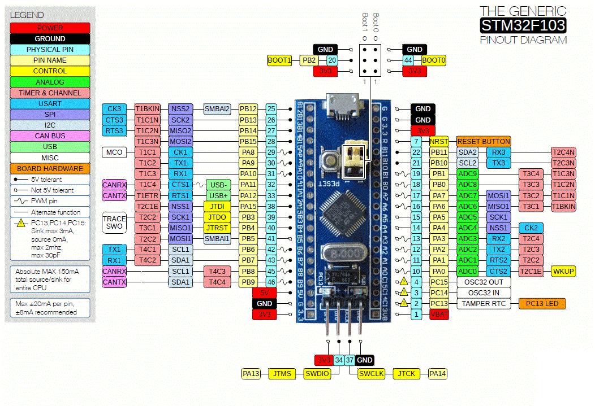
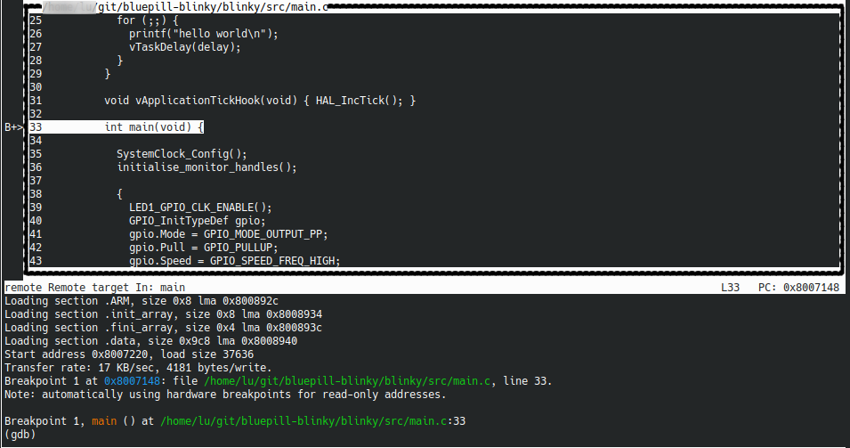
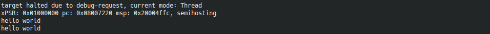

# bluepill-blinky
cmake project for STM32F103 ["Bluepill"](https://stm32-base.org/boards/STM32F103C8T6-Blue-Pill.html) board with FreeRTOS & STM32CubeF1

[](http://badges.mit-license.org)




---


## Configure & Build
Create build directory and configure using cmake:
```shell
% mkdir build && cd $_    
% cmake .. -DCMAKE_TOOLCHAIN_FILE=../toolchain/stm32f103.cmake -DCMAKE_BUILD_TYPE=Debug  
```
The build type is optional here, we use it in the example for Debug session. Build:
```shell
make -j
```


---


## Debug 
Fir start the debugger, in our case we're using OpenOCD:
```shell
% openocd --file openocd-stm32f103.cfg -c 'init'
Open On-Chip Debugger 0.10.0
Licensed under GNU GPL v2
For bug reports, read
        http://openocd.org/doc/doxygen/bugs.html
Info : The selected transport took over low-level target control. The results might differ compared to plain JTAG/SWD
adapter speed: 1000 kHz
adapter_nsrst_delay: 100
none separate
none separate
Info : Unable to match requested speed 1000 kHz, using 950 kHz
Info : Unable to match requested speed 1000 kHz, using 950 kHz
Info : clock speed 950 kHz
Info : STLINK v2 JTAG v33 API v2 SWIM v7 VID 0x0483 PID 0x3748
Info : using stlink api v2
Info : Target voltage: 6.424179
Info : stm32f1x.cpu: hardware has 6 breakpoints, 4 watchpoints
```
From the build directory we can now load our firmware and run it:
```shell
% gdb-multiarch -x ../debug.gdb blinky/bluepill_blinky.elf
```
You should see the following:


Once the program is running you should see the printf printing via semihosting in OpenOCD window:



---


---

## License
[](http://badges.mit-license.org)
- **[MIT license](http://opensource.org/licenses/mit-license.php)**